<!--
  This is your PROFILE README. It goes in a repo named exactly after your
  username (e.g. github.com/OCTOCAT/OCTOCAT) so GitHub shows it on your profile.
  Replace the ALL-CAPS placeholders. Widths 370/490 keep the portrait and info
  card the same height -- if you change the info card's H, re-match these.
-->

<table>
<tr>
<td valign="top"></td>
<td valign="top"></td>
</tr>
</table>

<!-- ======================= INTRO ======================= -->

<h1 align="center">Hey there, I'm AMRIT ARYA 👋</h1>

  

  
  
  

 

<!-- ======================= ABOUT ME ======================= -->

<h2 align="center">⚡ About Me</h2>

<table align="center">
<tr>
<td width="65%" valign="top">

### Hey! I'm AMRIT 👨‍💻

I'm a **Computer Science student** passionate about building systems that are reliable, scalable, secure, and automated.

- 🚀 Exploring **DevOps, Cloud & DevSecOps**
- ☁️ Learning **AWS, Docker, CI/CD & Infrastructure**
- 🔐 Interested in **Cloud Security & Secure Software Delivery**
- 🤖 Experimenting with **AI, Automation & Intelligent Systems**
- 🧠 Practicing **DSA, System Design & Problem Solving**
- 🛠️ Building projects that solve **real-world problems**
- 🌱 Always learning, experimenting, breaking things — and fixing them
- 🎯 Goal: Become a strong **Cloud / DevSecOps Engineer**

 

> **"Build it. Automate it. Secure it. Ship it."**

</td>

<td width="35%" align="center" valign="middle">

  

 

 

</td>
</tr>
</table>

 

<!-- ======================= TECH STACK ======================= -->

<h2 align="center">🧰 Tech Stack</h2>

  

  

  

 

<!-- ======================= CURRENTLY ======================= -->

<h2 align="center">🌱 Currently Exploring</h2>

  
  
  
  
  

 

<!-- ======================= GITHUB ANALYTICS ======================= -->

<h2 align="center">📊 GitHub Analytics</h2>

  
  

 

<!-- ======================= GITHUB STREAK ======================= -->

<h2 align="center">🔥 GitHub Streak</h2>

  

 

<!-- ======================= CONTRIBUTION ACTIVITY ======================= -->

<h2 align="center">📈 Contribution Activity</h2>

  

 

<!-- ======================= CONTRIBUTION SNAKE ======================= -->

<h2 align="center">🐍 Contribution Snake</h2>

  <picture>
    <source
      media="(prefers-color-scheme: dark)"
      srcset="https://raw.githubusercontent.com/amrit-arya/amrit-arya/output/github-contribution-grid-snake-dark.svg"
    >
    <source
      media="(prefers-color-scheme: light)"
      srcset="https://raw.githubusercontent.com/amrit-arya/amrit-arya/output/github-contribution-grid-snake.svg"
    >
    
  </picture>

<!--
===============================================================
GITHUB ACTION — CONTRIBUTION SNAKE
===============================================================

Create:
.github/workflows/snake.yml

Use the following workflow:

name: Generate Contribution Snake

on:
  schedule:
    - cron: "0 0 * * *"
  workflow_dispatch:

permissions:
  contents: write

jobs:
  generate:
    runs-on: ubuntu-latest

    steps:
      - name: Generate snake animation
        uses: Platane/snk@v3
        with:
          github_user_name: ${{ github.repository_owner }}
          outputs: |
            dist/github-contribution-grid-snake.svg
            dist/github-contribution-grid-snake-dark.svg?palette=github-dark

      - name: Publish snake animation
        uses: crazy-max/ghaction-github-pages@v4
        with:
          build_dir: dist
        env:
          GH_PAT: ${{ secrets.GITHUB_TOKEN }}

===============================================================
-->

 

<!-- ======================= CONNECT ======================= -->

<h2 align="center">🤝 Let's Connect</h2>

  
  
  

 

  <i>💚 Always learning. Always building. Always shipping.</i>

 

<!-- ======================= FOOTER ======================= -->

  

